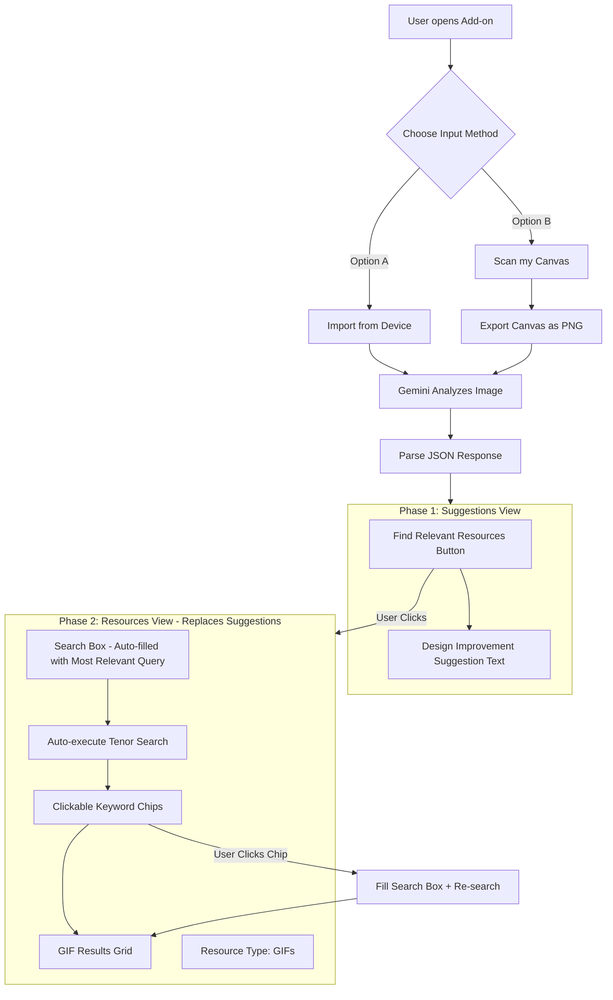

# V4 Implementation Plan: Enhanced Canvas Analysis

## Overview

Enhance both "Import from Device" and "Scan my Canvas" to show design improvement suggestions first, then reveal a resources search view when the user clicks "Find Relevant Resources".

---

## User Workflow



---

## Phase 1: Suggestions View (After Gemini Analysis)

```
+------------------------------------------+
| [Import from Device] [Scan my Canvas]    |
+------------------------------------------+
|                                          |
| [    Find Relevant Resources    ]        |  <- Primary action button
|                                          |
| "Your design could benefit from adding   |
|  more vibrant colors and dynamic         |
|  elements to capture attention..."       |  <- Suggestion text
|                                          |
+------------------------------------------+
```

---

## Phase 2: Resources View (After Button Click)

```
+------------------------------------------+
| [Import from Device] [Scan my Canvas]    |
+------------------------------------------+
| [Search: "happy celebration"      ] [Go] |  <- Auto-filled search
+------------------------------------------+
| [happy] [party] [dance] [fun] [colorful] |  <- Clickable chips
+------------------------------------------+
| Resource Type: (•) GIFs                  |  <- Radio (only GIFs for v4)
+------------------------------------------+
| +-------+ +-------+ +-------+ +-------+  |
| | GIF 1 | | GIF 2 | | GIF 3 | | GIF 4 |  |
| +-------+ +-------+ +-------+ +-------+  |
| | [Add] | | [Add] | | [Add] | | [Add] |  |
+------------------------------------------+
```

---

## Files to Modify

### 1. v3/src/ui/services/geminiService.js

**Add new function:** `analyzeDesign(base64Image, mimeType)`

```javascript
// New prompt for v4
const prompt = `Analyze this design/image and provide:
1. A brief suggestion (2-3 sentences) on how to improve or enhance the design
2. Search keywords optimized for finding relevant GIFs/memes

Return ONLY valid JSON in this exact format:
{
  "suggestion_for_improvements": "Your suggestion here...",
  "keywords": {
    "most_relevant": "primary search query",
    "other_keywords": ["keyword1", "keyword2", "keyword3", "keyword4"]
  }
}`;
```

**Keep existing:** `performOCR()` for backwards compatibility

---

### 2. v3/src/ui/components/App.js

**New State Variables:**

```javascript
@state() _geminiResult = null;        // { suggestion, keywords }
@state() _showResourcesView = false;  // Toggle between phases
@state() _otherKeywords = [];         // Array of clickable keywords
@state() _selectedResourceType = "gifs"; // For v4, only "gifs"
```

**Modified Handlers:**

- `_handleFileUpload()` - Call `analyzeDesign()`, store result, show Phase 1
- `_handleScanFromCanvas()` - Call `analyzeDesign()`, store result, show Phase 1

**New Handlers:**

- `_handleFindResources()` - Switch to Phase 2, auto-fill search, auto-execute search
- `_handleKeywordClick(keyword)` - Fill search box with keyword, trigger search

**Render Logic:**

```javascript
// Show Phase 1 OR Phase 2 based on _showResourcesView
${this._geminiResult && !this._showResourcesView 
  ? this._renderSuggestionsView() 
  : ''}
${this._showResourcesView 
  ? this._renderResourcesView() 
  : ''}
```

---

### 3. v3/src/ui/components/App.css.js

**New Styles:**

- `.suggestions-view` - Container for Phase 1
- `.find-resources-btn` - Prominent primary button
- `.suggestion-text` - Styled paragraph for suggestions
- `.resources-view` - Container for Phase 2
- `.keywords-container` - Flex container for chips
- `.keyword-chip` - Clickable tag styling with hover state
- `.resource-type-selector` - Radio button group

---

## Expected Gemini Response

```json
{
  "suggestion_for_improvements": "Your design could benefit from adding more vibrant accent colors to draw attention to key elements. Consider using dynamic visual elements like motion graphics or expressive imagery to make the composition more engaging.",
  "keywords": {
    "most_relevant": "colorful celebration",
    "other_keywords": ["happy", "vibrant", "party", "energy", "dynamic"]
  }
}
```

---

## Implementation Sequence

1. **geminiService.js** - Add `analyzeDesign()` with new JSON prompt
2. **App.js** - Add new state variables
3. **App.js** - Update `_handleFileUpload()` and `_handleScanFromCanvas()`
4. **App.js** - Add `_handleFindResources()` and `_handleKeywordClick()`
5. **App.js** - Add `_renderSuggestionsView()` and `_renderResourcesView()` methods
6. **App.js** - Update main `render()` to conditionally show views
7. **App.css.js** - Add all new styles
8. **Versioning Document.md** - Update documentation

---

## Key Behaviors

1. **Both input methods trigger same flow** - Upload and Scan both call `analyzeDesign()` and show suggestions first

2. **Phase transition** - Clicking "Find Relevant Resources" replaces the suggestion text block with the resources view (search + chips + results)

3. **Auto-search on transition** - When entering Phase 2, immediately execute search with `most_relevant` keyword

4. **Chip click behavior** - Clicking any keyword chip fills the search box and triggers a new search

5. **Resource type selector** - Shows only "GIFs" radio for v4 (prepared for future expansion)

---

## Implementation Checklist

- [ ] Add `analyzeDesign()` function in geminiService.js returning suggestion + keywords JSON
- [ ] Add state variables for geminiResult, showResourcesView, and otherKeywords
- [ ] Modify `_handleFileUpload()` to call new analyzeDesign() and show suggestions view
- [ ] Modify `_handleScanFromCanvas()` to call new analyzeDesign() and show suggestions view
- [ ] Add suggestions view with button and suggestion text in render()
- [ ] Add resources view with search box, keyword chips, radio selector, and GIF grid
- [ ] Add CSS styles for suggestions panel, keyword chips, and resources view
- [ ] Update Versioning Document.md to mark v3 complete and document v4
